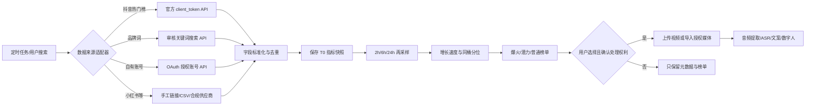
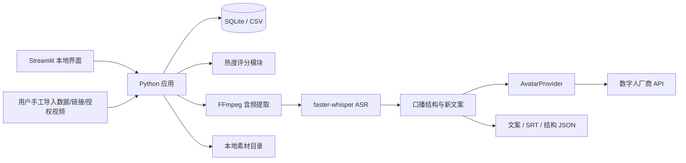
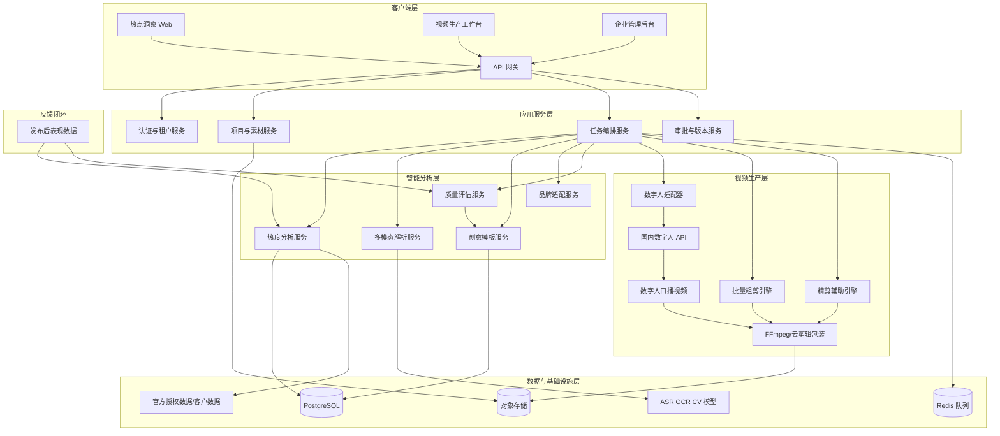
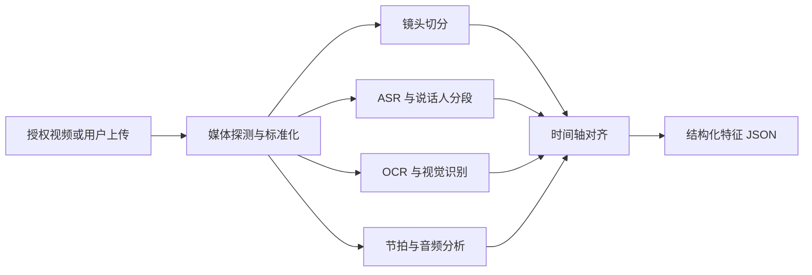
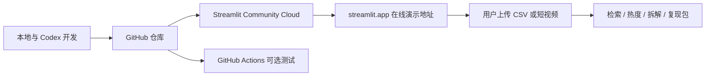

# 短视频热点洞察与智能生产系统

> **商业汇报与产品可行性说明（B 端沟通版）**  
> 版本：v1.6｜日期：2026-07-17｜适用对象：公司管理层、品牌客户、内容营销服务商及项目实施团队

## 管理层摘要

### 一句话定位

本项目不是“自动搬运爆款视频”的工具，而是一套面向品牌内容团队的**热点发现、量化判断和授权视频转写工作台**：帮助客户更快找到值得跟进的内容方向，将公开视频指标、客户自有数据和授权素材沉淀为可检索、可解释、可复盘的内容资产。

### 客户为什么愿意了解

品牌内容团队普遍面临四个问题：

1. 每天人工刷平台找选题，时间投入高且结果依赖个人经验。
2. 点赞、评论、分享、播放量分散，难以判断一个视频是“真正异常增长”还是“大账号正常流量”。
3. 口播视频听写、整理和校对重复耗时，团队难以形成统一素材库。
4. 热点、文案和实际发布效果之间缺少记录，成功经验无法持续复用。

系统首期以“候选收集—指标快照—热度排序—授权视频转写”为闭环，先解决最确定、最容易验证、也最适合进入企业工作流的部分。

### 首期交付与后续路线

| 阶段 | 客户可获得的能力 | 当前承诺 |
|---|---|---|
| 第一阶段：热点与转写 MVP | 手工/CSV/官方授权数据导入、互动指标快照、热度排序、授权媒体上传、TXT/JSON/SRT 转写、人工校对、任务记录 | **当前建设范围** |
| 第二阶段：内容拆解与改写 | 提炼开场钩子、内容节奏、卖点顺序和 CTA，基于品牌要求生成新文案 | 需在第一阶段被客户验证后立项 |
| 第三阶段：数字人与剪辑 | 对接合法授权的数字人或云剪辑厂商，生成可审核的视频初稿 | 后续增值模块，不作为首期销售承诺 |

### 管理层建议

- 建议先选择 **1 个行业、1～2 家意向客户、20～50 条样本视频**，完成 2～4 周联合试点。
- 试点不以“抓取全网视频”为卖点，而以**节省调研时间、提高候选命中率、缩短转写校对时间和形成可复盘数据**为评价标准。
- 在客户连续使用、愿意提供数据且认可结果前，不提前投入多租户平台、重型云架构或大规模自动剪辑。
- 第一阶段通过后，优先销售“热点洞察 + 内容转写”服务；改写、数字人和剪辑按客户需求作为增购模块。

### 本项目的商业判断

**建议推进小规模试点，但不建议现阶段重投入。** 技术实现难度可控，真正决定商业价值的是平台数据权限、客户是否愿意接入自有数据，以及系统输出能否稳定减少人工时间。最合理的路径是用低成本 MVP 换取真实客户证据，再决定产品化投入。

## 项目概述

**项目名称**：短视频热点洞察与智能生产系统（video-intelligence-production）

**功能定位**：面向品牌营销团队、小型内容机构和企业自运营团队，首期建立“热点候选发现/导入 → 互动指标快照 → 热度排序 → 授权媒体上传 → 音频提取与文案转写”的闭环，降低选题研究、数据整理和口播转写成本。结构提取、文案改写、数字人和自动剪辑作为后续扩展，不阻塞首期 MVP。

**首期平台优先级**：抖音 P0（官方热门榜、受限关键词搜索、授权账号数据）；小红书 P1（手工链接/指标导入与合规供应商，暂不承诺官方全站检索）；快手 P2（授权账号数据适配）。

**首期客户**：品牌营销团队及 3～20 人内容团队。

**首期原型边界**：建设“爆火候选检索/导入 → 量化排序 → 用户选择并上传有权处理的视频 → 提取音频 → ASR 转写文案 → 在线校对与结果下载”闭环。视频必须来自用户上传、客户自有账号或明确授权来源。结构拆解、新文案改写、数字人合成与自动剪辑均为后续模块，不进入首期验收。

**当前开发模式**：1 名开发者 + Codex，采用 vibe coding 快速迭代；先完成单机、单用户、单赛道原型，再根据真实使用反馈决定是否工程化。

**产品形态**：
1. **首期热点洞察工作台**：候选导入、指标快照、热度榜单、品牌/自有账号内容复盘。
2. **首期音视频转写工作台**：音频提取、ASR 转写、字幕生成、低置信度标记、在线校对和结果下载。
3. **后续内容策略模块**：创意结构模板、品牌化新文案和版本对比。
4. **后续数字人与剪辑模块**：通过合规厂商接口生成口播初稿，并增加字幕、背景、品牌元素和批量版本。

**核心商业价值与试点目标**：
- 热点筛选：验证能否将每日人工浏览和整理时间降低 **50% 以上**。
- 授权视频转写：验证 60 秒清晰普通话视频能否在 **5 分钟内完成人工校对**。
- 选题决策：将“凭经验判断爆款”转化为包含互动、增长、账号规模和发布时间的可解释排序。
- 组织资产：保留指标快照、转写结果、人工修改和任务记录，帮助团队复盘而不是只看一次性榜单。
- 合规控制：候选发现与媒体处理分离，只有客户自有或明确授权的视频进入转写和后续生产流程。

上述数字均为试点验收目标，不应在未完成客户样本验证前作为对外效果保证。

**当前 MVP 技术栈（免费、单机优先）**：
- **开发语言**：Python 3.12（本机已安装）
- **原型界面**：Streamlit；需要稳定 API 时再增加 FastAPI
- **数据分析**：Pandas、NumPy、scikit-learn
- **视频处理**：首期使用 FFmpeg/FFprobe；OpenCV、PySceneDetect 后置
- **语音识别**：faster-whisper `tiny/base` 量化模型，本地按需运行
- **数据库**：SQLite；小规模阶段也可直接使用 CSV/JSON
- **文件存储**：本地目录，不使用对象存储
- **任务执行**：单进程串行队列，不引入 Redis/Celery
- **运行方式**：Windows 原生运行；开发期不依赖 Docker、云服务器或 Kubernetes
- **测试与日志**：pytest、Python logging、本地运行记录
- **可复用组件来源**：优先选用维护活跃、许可证明确的 GitHub 开源项目，不重复实现镜头检测、ASR、OCR 和原型界面。
- **后续剪辑接口**：内部保存厂商无关的 Timeline JSON，第二阶段再适配阿里云、腾讯云或火山引擎。

**商业化后备技术栈**：当出现真实付费客户、多人协作或远程访问需求后，再评估 React、Node.js/FastAPI、PostgreSQL、Redis、对象存储和容器部署。后备架构不是当前开发前置条件。

> 说明：平台接口、数据字段和授权范围会变化。原型必须同时支持“官方授权接口”“客户自有账号数据导入”“手工导入热点链接/数据文件”三种路径，避免把商业可行性建立在未经授权的全站抓取上。

## 可行性结论

| 模块 | 技术可行性 | 首期建议 | 主要限制 |
|---|---:|---|---|
| 热度分析 | 高 | 必做 | 数据授权、跨赛道归一化、冷启动 |
| 授权媒体转写与校对 | 高 | 必做 | 音频质量、方言与品牌专有词 |
| 创意结构模板提取 | 中高 | 第二阶段验证 | 多模态识别误差、模板质量评价 |
| 品牌内容适配 | 中高 | 第二阶段验证 | 品牌安全、事实正确性、素材匹配 |
| 数字人与批量粗剪 | 中高 | 第三阶段按需接厂商 | Timeline 映射、接口成本、素材授权 |
| 自动精剪 | 中 | 第四阶段验证 | 审美主观、接口可控性、费用与版权 |
| 效果归因与模型迭代 | 中 | 试点期接入 | 样本量小、平台数据回传延迟 |

**总体结论**：以“1 名开发者 + Codex”采用 vibe coding，可以在 **5 天完成可演示原型、2 周完成第一阶段 MVP**。第一阶段只做一个赛道、候选数据导入、指标快照、热点排序、授权视频上传、音频转写、在线校对和结果下载。结构拆解、文案改写、数字人、字幕美化与自动剪辑均在客户验证首期价值后再增加，不自研数字人模型。

## 当前机器实测与能力边界

### 实测配置（2026-07-17）

| 项目 | 当前配置 | MVP 判断 |
|---|---|---|
| CPU | AMD Ryzen 7 5800H，8 核 16 线程 | 足够进行数据分析、视频探测和单任务 FFmpeg 渲染 |
| 内存 | 约 14GB，可用约 5.3GB | 可以开发，但不适合同时启动 Docker、多模型和多个渲染任务 |
| 独立显卡 | NVIDIA GTX 1650，4GB 显存 | 可尝试 NVENC 和轻量 ASR；不适合大型多模态模型 |
| 集成显卡 | AMD Radeon，约 2GB | 不作为模型推理主设备 |
| 磁盘 | C 盘约 474GB，剩余约 324GB | 足够原型；建议项目临时文件上限 50GB并自动清理 |
| 系统 | Windows 10 专业版 64 位 | 可直接使用 Python、FFmpeg 和本地 Web 界面 |
| 已有工具 | Node 24、npm 11、Python 3.12、Git、Docker | 基础开发环境已具备 |
| 缺少工具 | FFmpeg | 开发前唯一必须补齐的核心工具 |

### 本机适合完成

- CSV/JSON 数据导入、热度评分、榜单和可视化。
- 15～60 秒短视频的镜头切分、关键帧、轻量 ASR 和基础 OCR。
- 使用 720p 代理文件编辑，最终串行输出 1080×1920 视频。
- 一次处理 1 个重任务，串行拆解 5～20 条短视频。
- 使用小样本人工校验模板和热度阈值。

### 本机暂不承担

- 大型视觉语言模型、文生视频或高显存模型本地推理。
- 多用户并发、实时全站数据抓取和大规模视频库索引。
- 同时运行多个 Docker 服务与多个高清视频渲染任务。
- 4K 精剪、复杂特效、实时预览和商业级云渲染集群。

### 本机优化原则

1. 默认生成 720p 代理文件，最终阶段才渲染 1080p。
2. ASR 默认使用 `tiny/base` 量化模型；识别质量不足时允许人工修正字幕。
3. 串行执行视频任务，内存使用超过 11GB 时暂停新任务。
4. 每个项目限制原素材、代理和成片总空间，完成后清理缓存。
5. 不在开发期启动 Kubernetes、PostgreSQL、Redis、MinIO 和监控套件。

## 当前技术选型：GitHub 复用与厂商接口

### GitHub 开源组件清单

| 能力 | 推荐项目 | 当前用途 | 是否进入第一阶段 |
|---|---|---|---:|
| 镜头切分 | [PySceneDetect](https://github.com/Breakthrough/PySceneDetect) | 检测硬切、淡入淡出，输出镜头起止时间；官方仓库提供 Python API，并依赖 FFmpeg 完成切分 | 第二阶段 |
| 语音转文字 | [faster-whisper](https://github.com/SYSTRAN/faster-whisper) | 本地提取口播字幕和时间戳；支持 CPU/GPU 及 8-bit 量化，适合当前机器使用小模型 | 是 |
| 画面文字识别 | [PaddleOCR](https://github.com/PaddlePaddle/PaddleOCR) | 提取标题、贴纸、商品卖点和 CTA；按关键帧运行 | 第二阶段，可降级 |
| 原型界面 | [Streamlit](https://github.com/streamlit/streamlit) | 快速制作检索、榜单、拆解结果和模板编辑页面 | 是 |
| 视频探测与关键帧 | FFmpeg/FFprobe | 获取时长、编码、分辨率、抽帧和音频分离 | 是 |
| 数据与评分 | Pandas、NumPy、scikit-learn | 分位数、热度得分、相似度和离线评估 | 是 |
| 向量检索 | FAISS 或轻量余弦相似度 | 模板和视频结构相似检索；样本少时先用 NumPy，不提前部署向量数据库 | 后置可选 |

**引入规则**：
1. 只引入直接解决当前功能的项目，避免“为了可能用到”增加依赖。
2. 固定版本并保存许可证清单；开源不等于没有商用义务。
3. 先通过 3～5 条样例验证速度和输出，再写入正式流水线。
4. GitHub 上的非官方抖音/快手采集器不作为商业核心依赖；此类项目容易因平台变化失效，也可能触及平台条款和数据合规问题。

### 国内厂商视频处理接口候选

| 厂商能力 | 官方已公开能力 | 适合场景 | 当前决策 |
|---|---|---|---|
| [阿里云智能媒体服务云剪辑](https://help.aliyun.com/zh/ims/user-guide/cloud-clip) | 多视频、音频、图片和字幕按 Timeline 合成，支持高级模板、贴纸、滤镜、特效和字幕；按成片时长计费 | 模板化批量生产、复杂 Timeline | 第二阶段优先 POC 候选 |
| [腾讯云点播视频合成](https://cloud.tencent.com/document/api/266/35286) | 裁剪、拼接、画中画、混音、音量、转场等合成能力 | 稳定的基础批量剪辑与合成 | 第二阶段优先 POC 候选 |
| [腾讯云媒体处理](https://cloud.tencent.com/document/product/436/120951) | 工作流、批量任务、视频标签、拆条、智能封面、质量评分和视频合成 | 后续批量任务和视频分析 | 作为腾讯方案扩展能力 |
| [火山引擎视频剪辑 SDK](https://www.volcengine.com/docs/4/127538?lang=en) | 提交异步视频剪辑任务 | 异步云端剪辑 | 第二阶段备选 |
| [火山引擎智能剪辑/视频理解](https://www.volcengine.com/docs/6492/2192001?lang=en) | 自然语言剪辑、片段检测、ASR 增强和标准化剪辑决策 | 精剪辅助、高光和特定片段提取 | 第三阶段验证，需确认开通与报价 |

厂商剪辑接口不是免费组件。开发期默认使用 `MockRenderProvider` 模拟提交、查询和完成回调；只有数字人口播闭环获得用户认可后，才用少量真实素材完成剪辑 POC。各厂商活动、权限和价格会变化，接入前重新核验，不把当前优惠当作长期成本依据。

### 厂商无关接口

```python
class RenderProvider:
    def submit(self, timeline: dict) -> str:
        """提交标准时间线，返回厂商任务 ID。"""

    def get_status(self, job_id: str) -> dict:
        """查询任务状态、进度、错误码和预估费用。"""

    def get_result(self, job_id: str) -> dict:
        """返回成片地址、媒体信息和实际费用。"""
```

上述剪辑与数字人接口作为远期架构参考，不进入第一阶段代码和验收。客户验证“热点洞察 + 授权视频转写”价值后，再按实际需求实现 `AvatarProvider` 或 `AliyunRenderProvider`、`TencentRenderProvider`、`VolcengineRenderProvider`，避免产品逻辑被单一厂商锁定。

### 爆火视频检索的数据边界

- 抖音是第一阶段唯一值得优先申请官方数据权限的平台。官方[热门视频榜](https://open.douyin.com/platform/resource/docs/openapi/data-open-service/tops-data/hot-video-list/hot-video-list/)可返回最近 24 小时的热门视频排行、标题、作者、播放、点赞、评论、热词、热度值和分享页，数据每天产出；该接口需要申请权限，但不要求单个用户授权。
- 抖音[关键词视频搜索](https://open.douyin.com/platform/resource/docs/ability/search-management/video/)只允许申请与自身业务紧密相关的关键词，不允许通用品类词或竞品词，而且只返回最近 1 天的公开视频；它适合品牌舆情与品牌词监测，不等于任意赛道全网搜索。
- 抖音[授权账号视频列表](https://open.douyin.com/platform/resource/docs/openapi/video-management/douyin/search-video/account-video-list)和[特定视频数据](https://open.douyin.com/platform/resource/docs/openapi/video-management/douyin/search-video/video-data/)需要用户 OAuth 授权和相应权限，可取得授权账号作品的播放、点赞、评论、分享等实时数据，适合客户自有账号复盘。
- 小红书当前公开的[分享开放平台](https://agora.xiaohongshu.com/doc)主要提供将图文或视频分享到小红书的 SDK；公开的[开放平台 API](https://open.xiaohongshu.com/document/api?apiId=5739&apiNavigationId=3&gatewayId=103&gatewayVersionId=1661&id=3)主要覆盖订单、商品、库存、物流等电商能力。当前未发现面向普通开发者的“全站笔记搜索 + 任意笔记互动统计 + 视频文件获取”官方接口，因此不能把小红书爆款检索建立在官方 API 假设上。
- 快手可作为后续授权账号适配器。官方开放平台可在用户授权范围内返回作品播放地址、观看、点赞和评论等字段，但开放平台规则对数据用途有限制，商业化前必须按应用实际场景重新申请并确认许可范围。
- 因此第一阶段提供四种入口：`抖音官方热门榜`、`手工粘贴视频链接/可见指标`、`导入 CSV/Excel`、`客户自有账号官方授权 API`。如果后续采购合规第三方数据，只替换数据适配器，不修改热度模型和复现流程。

#### 平台能力与首期决策

| 平台/来源 | 可稳定取得的数据 | 不能默认取得的数据 | 首期决策 |
|---|---|---|---|
| 抖音热门视频榜 | rank、title、author、play、like、comment、hotValue、shareUrl、最近 24h 榜单 | 任意关键词全网历史视频、原始视频文件 | P0，立即申请并开发适配器 |
| 抖音品牌关键词搜索 | 已审核品牌/产品词最近 1 天公开视频及评论 | 通用品类词、竞品词、任意时间范围 | 有企业品牌词时 P0 |
| 抖音授权账号 | 客户授权账号的视频列表、播放、点赞、评论、分享等 | 未授权竞品账号的后台数据 | P0，用于自有账号基线与效果回流 |
| 小红书官方开放能力 | 分享发布 SDK、电商业务 API | 普通开发者全站笔记检索、通用互动数据、任意视频下载 | P1，手工导入先行，不先做官方爬虫 |
| 快手授权账号 | 授权作品及部分播放、点赞、评论、播放地址字段 | 全站任意赛道热点库 | P2，抖音闭环完成后再接 |
| 合规第三方数据 | 依合同与字段清单确定 | 不可假设拥有媒体版权 | 有真实客户后评估采购 |

#### 抓取与同步逻辑

系统把“抓取”拆成**候选元数据发现**与**媒体文件导入**两条链，二者不能混为一谈：



**适配器执行规则**：
1. `QueryPlanner` 将平台、赛道、关键词、发布时间和账号档位转成数据源请求；关键词必须记录审批状态和业务归属。
2. `SourceAdapter.fetch()` 获取一页候选；官方接口保存请求时间、scope、cursor 和原始响应摘要，手工来源保存填报人和证据链接。
3. `Normalizer` 将平台字段映射为统一字段，使用 `platform + platformItemId` 去重；同一作品每次采集只新增指标快照，不覆盖历史值。
4. 首次保存 `T0`，潜力样本在 `T+2h`、`T+6h`、`T+24h` 复采。无法复采的样本只能算静态热度，不能计算增长加速度。
5. 请求遵守平台频率限制；遇到 429 按响应头或平台规则延后。网络或接口连接失败最多自动重试一次，之后记录失败并提示人工处理。
6. 非官方网页适配器只允许作为本地研究 POC：读取无需登录即可看到的标题、作者、发布时间和互动数字，不使用账号 Cookie 池、代理池、验证码绕过、签名破解或隐藏接口，不自动下载视频，也不作为商业版承诺能力。
7. 选中候选后必须单独通过“媒体权利门禁”：用户上传有权处理的文件，或提供官方授权/供应商明确允许处理的媒体地址；只有分享页链接而无媒体处理权时，只做热点记录，不进入 ASR。

**建议同步频率**：抖音热门视频榜每天 10:15 后同步一次；审核品牌词每 30～60 分钟同步一次；进入观察池的候选按 2/6/24 小时复采；小红书手工数据在用户导入时保存快照。实际频率以接口审批结果和限流规则为准。

## 口播文案提取与数字人合成流程

### 业务闭环


### 步骤 1：确定视频输入

系统只接受以下输入：
- 用户自行上传且有权处理的 MP4/MOV 文件。
- 客户自有账号或已获授权账号的视频。
- 合规数据服务返回的元数据和经授权媒体地址。

首期不内置去水印下载、绕过登录、批量搬运或非官方平台爬虫。热点检索结果可以先保存链接和互动指标，用户选择需要拆解的视频后再上传授权文件。

### 步骤 2：提取音频

使用 FFprobe 检查视频时长、音轨和编码，再使用 FFmpeg 提取适合 ASR 的单声道音频：

```bash
ffmpeg -i input.mp4 -vn -ac 1 -ar 16000 -c:a pcm_s16le speech.wav
```

输出：
- `media.json`：时长、分辨率、音轨和文件摘要。
- `speech.wav`：16kHz 单声道语音文件。
- `audio_quality.json`：静音比例、峰值和基础噪声提示。

首期不做复杂人声分离。背景音乐过大时提示用户换源或人工确认，避免在本机引入高成本分离模型。

### 步骤 3：音频转文字（ASR）

使用 faster-whisper `tiny/base`，默认启用 VAD、词级时间戳和 `int8` 计算。生成四种结果：

```text
transcript.txt          # 连续纯文案
transcript.json         # 分段、时间戳、置信度和语言
subtitles.srt           # 可直接用于后续字幕
review_items.json       # 低置信度、数字、品牌词和疑似错词
```

转写结果示例：

```json
{
  "language": "zh",
  "durationSec": 38.2,
  "segments": [
    {
      "start": 0.0,
      "end": 2.8,
      "text": "很多人防晒第一步就做错了",
      "confidence": 0.92,
      "needsReview": false
    }
  ],
  "lowConfidenceCount": 2
}
```

### 步骤 4：文案校对

自动校对只处理确定性较高的问题：
- 恢复标点、数字和段落。
- 标记同音词、产品名、人名、金额和低置信度片段。
- 允许用户一边播放对应时间段一边修改文字。
- 保存 `raw`、`corrected` 两个版本，禁止覆盖原始转写结果。

口播 ASR 的 MVP 目标：清晰普通话视频人工校对后的文案可用率 ≥ 90%，单条 60 秒视频人工校对时间 ≤ 5 分钟。字错率受口音、音乐、降噪和录音质量影响，不能把全自动 100% 准确作为验收条件。

### 步骤 5：爆款口播结构拆解

校对后的文案按以下字段拆解：

```json
{
  "hook": "前 3 秒反常识或痛点",
  "targetAudience": "目标人群",
  "painPoint": "主要问题",
  "coreClaim": "核心观点",
  "proof": ["案例", "数据", "演示"],
  "solutionSteps": ["步骤一", "步骤二"],
  "cta": "关注、评论、咨询或购买引导",
  "durationSec": 38,
  "wordsPerMinute": 240,
  "pausePoints": [2.8, 9.5, 24.0]
}
```

系统同时提取前 3 秒钩子、句长、语速、停顿、情绪变化、重复强调和 CTA 位置，形成可以跨产品复用的口播模板。

### 步骤 6：生成新文案

生成新文案的输入包括：
- 目标产品和经过确认的事实资料。
- 目标用户、核心痛点、语气和视频时长。
- 禁用词、风险表述、品牌词和 CTA。
- 爆款结构模板，不直接把原文作为输出模板。

输出至少包含：
- `script_draft`：新口播文案。
- `script_segments`：带预计时长和停顿的分段文案。
- `fact_sources`：每个产品事实的来源。
- `similarity_report`：与参考文案的连续重复片段和语义相似风险。

系统可将“连续相同文本超过 20 个汉字”设为内部复核触发条件，但该数字只是产品风控规则，不是版权免责标准。出现高相似度时必须重新表达、替换案例和调整论证顺序。

### 步骤 7：数字人驱动方式

#### 文本驱动（首版推荐）

将审核后的新文案、数字人形象、音色、语速、背景和标题提交给数字人厂商。厂商完成 TTS、嘴型驱动和视频渲染。

优点：接口最少、无需单独维护 TTS、文案修改成本低。缺点：音色和停顿受厂商能力限制。

#### 音频驱动（第二选择）

先使用授权 TTS 音色生成音频，再把音频提交给数字人厂商驱动嘴型。

优点：可精确控制声音、停顿和情绪。缺点：多一次合成步骤；声音克隆必须获得声音权利人明确授权。

### 国内数字人接口候选

| 厂商 | 官方能力 | 输入方式 | 首版判断 |
|---|---|---|---|
| [百度曦灵高级视频合成](https://cloud.baidu.com/doc/AI_DH/s/llywx52pw) | 预置数字人模板、标题、Logo、背景和 BGM，异步生成播报视频 | 文本或音频 | 最适合先做接口 POC，文本/音频两条路线都能验证 |
| [腾讯云智能数智人](https://cloud.tencent.com/document/product/1240/44691) | 购买播报资源后可通过 PaaS 接口输入文本生成数字人播报视频 | 文本为主 | 能力明确，但需先确认资源包和接口授权 |
| [火山引擎克隆数字人](https://www.volcengine.com/docs/85128/1770764) | 使用数字人形象和音频生成数字人说话视频，支持较长口播 | 音频 | 适合后续自有形象/音色，免费试用阶段形象创建受限 |
| [百度千帆 K-Avatar](https://cloud.baidu.com/doc/qianfan-api/s/Dmlf78tao) | 参考图像加音频生成数字人视频 | 音频 | 适合 60 秒以内的图片数字人备选验证 |

厂商能力、免费试用和价格可能变化，真实接入前以控制台为准。第一阶段代码默认使用 Mock Provider；获取合法测试账号和密钥后，只提交 1～3 条短视频验证。

### 数字人统一适配接口

```python
class AvatarProvider:
    def submit_text(self, script: str, avatar_id: str, voice_id: str) -> str:
        """提交文本驱动任务，返回任务 ID。"""

    def submit_audio(self, audio_url: str, avatar_id: str) -> str:
        """提交授权音频驱动任务，返回任务 ID。"""

    def get_status(self, job_id: str) -> dict:
        """查询任务状态；连接失败最多自动重试一次。"""

    def get_result(self, job_id: str) -> dict:
        """返回数字人视频地址、时长、费用和错误信息。"""
```

第一阶段实现 `MockAvatarProvider` 和一家真实厂商适配器。业务层只依赖统一接口，后续更换厂商时不修改检索、ASR 和文案模块。

### 完整输出包

```text
output/{project_id}/
├── source_metadata.json
├── speech.wav
├── transcript_raw.json
├── transcript_corrected.txt
├── subtitles.srt
├── viral_structure.json
├── rewritten_script.json
├── similarity_report.json
├── avatar_job.json
└── avatar_video_url.txt
```

## 业务痛点与目标用户

### 1. 品牌营销团队

**实际痛点**：
- 热点发现依赖个人经验，错过最佳跟进窗口。
- 爆款拆解停留在截图和口头描述，无法形成可复用资产。
- 品牌素材多但检索困难，脚本与素材无法快速匹配。
- 外包制作周期长，批量版本成本高，修改过程不可控。

**付费动机**：缩短内容周转周期、提升素材复用率、统一品牌规范、量化团队产能。

### 2. 小型内容机构与本地商家服务商

**实际痛点**：
- 同时服务多个客户，重复劳动占比高。
- 需要快速生成不同行业、门店和活动版本。
- 人员流动导致模板和经验无法沉淀。

**付费动机**：提高人均交付量、建立模板资产、降低培训成本。

### 3. 企业自运营团队

**实际痛点**：
- 缺少专业数据分析和剪辑人员。
- 内容审核、品牌安全和数据隔离要求高。
- 通用生成工具无法理解企业素材和业务约束。

**付费动机**：私有素材库、权限审批、合规留痕、企业部署能力。

## 技术架构图

### 当前单机 MVP 架构



该架构全部运行在当前 Windows 电脑上，无服务器、无云数据库、无对象存储、无常驻付费 API。视频解析和渲染使用串行任务，避免占满内存。

### 商业化目标架构（后置参考）



## 系统边界与合规原则

1. 只处理客户拥有权利或明确授权分析的内容与素材。
2. “快速复现”指复用创意结构、节奏规律和元素组合，不生成原视频副本。
3. 不提供去水印、绕过平台访问控制、批量搬运下载、原声/原画面复制能力。
4. 音乐、字体、图片、人物肖像和第三方素材必须记录授权来源与使用范围。
5. 平台数据优先使用官方开放能力和授权账号数据。[抖音视频数据接入方案](https://open.douyin.com/platform/resource/docs/ability/open-data/video-data-solution)和[能力权限说明](https://open.douyin.com/platform/resource/docs/accession-guide/type-and-permission)显示，视频数据能力需要权限申请和用户授权，关键词搜索也属于受限能力，因此全站热点库不能被视为天然可得。
6. 数据不可稳定获取时，系统降级为“客户自有账号数据 + 手工导入热点链接/CSV + 第三方合规数据服务”。
7. 企业数据按租户隔离，敏感素材支持私有部署、加密存储、访问审计和到期删除。
8. 数字人形象和克隆音色必须来自官方授权素材或权利人明确授权，不复刻参考视频中主播的脸和声音。
9. 数字人视频发布前由用户确认目标平台当时有效的 AI 生成内容标识、广告和行业合规要求。

## 目录结构说明

### 当前 MVP 目录

```text
video-intelligence-production/
├── app.py                    # Streamlit 本地入口
├── .streamlit/
│   └── config.toml           # 页面、上传大小和运行配置
├── src/
│   ├── heat.py               # 热度计算与解释
│   ├── sources.py            # 数据源适配器、快照与字段标准化
│   ├── audio.py              # FFmpeg 音频提取与质量检查
│   ├── asr.py                # faster-whisper 转写与 SRT
│   ├── parser.py             # 视频探测、镜头与关键帧
│   ├── template.py           # 创意模板 JSON
│   ├── reproduce.py          # 口播结构、新文案和相似风险
│   ├── timeline.py           # 后续剪辑 Timeline 与 Schema 校验
│   └── providers/
│       ├── avatar_base.py    # 数字人统一接口
│       ├── avatar_mock.py    # 免费模拟适配器
│       └── avatar_vendor.py  # 首家真实厂商适配器
├── data/
│   ├── samples/              # 样例数据
│   ├── assets/               # 用户自有素材
│   ├── outputs/              # 转写、文案、模板、数字人任务和复现包
│   └── app.sqlite            # 本地数据库
├── tests/                    # 热度、ASR、文案和 Provider 测试
├── requirements.txt
├── packages.txt              # Streamlit Cloud 安装 FFmpeg 等 Linux 系统依赖
├── .gitignore                # 排除密钥、上传视频、缓存和本地数据库
└── README.md
```

先保持 5 个核心模块和一个本地入口；只有文件明显变大、真实用户增加后才拆分服务。

### 商业化目标目录（后置参考）

```text
video-intelligence-production/
├── apps/
│   ├── web/                         # 热点洞察与视频工作台前端
│   ├── api/                         # 业务 API、鉴权、租户与项目管理
│   └── worker/                      # 队列任务与渲染任务执行器
├── services/
│   ├── heat-analyzer/               # 热度特征、评分、榜单与异常检测
│   ├── multimodal-parser/           # ASR、OCR、镜头、节拍、视觉语义
│   ├── template-extractor/          # 创意结构模板提取与版本管理
│   ├── content-adapter/             # 品牌脚本与素材适配
│   ├── edit-engine/                 # 时间线、字幕、音频、转场、渲染
│   └── quality-evaluator/           # 技术质量、品牌规则与内容质量评分
├── packages/
│   ├── timeline-schema/             # 跨模块复用的时间线 JSON Schema
│   ├── template-schema/             # 创意模板 JSON Schema
│   ├── media-utils/                 # FFmpeg、探针、转码与缩略图工具
│   └── shared-types/                # 共享类型、错误码与事件定义
├── config/                          # 环境、模型、阈值、租户策略配置
├── migrations/                      # 数据库迁移
├── data/                            # 原型数据、标签和离线评测集
├── tests/
│   ├── unit/                        # 单元测试
│   ├── integration/                 # 服务与渲染集成测试
│   ├── evaluation/                  # 模型离线评测
│   └── e2e/                         # 端到端业务测试
├── docs/                            # 产品、接口、模型卡与运维文档
├── docker-compose.yml
├── package.json
├── pyproject.toml
└── README.md
```

## 核心模块说明

### 1. 数据接入服务（dataIngestion）

**职责**：
- 接入抖音官方热门榜、审核品牌关键词、官方授权账号、客户上传数据和手工导入链接。
- 统一平台字段、采样时间、作者、作品、赛道和账号规模口径。
- 记录数据来源、授权范围、采集时间、缺失字段和可信度。
- 对重复作品、异常值和机器人互动进行基础清洗。

**数据最小字段**：

```json
{
  "platform": "douyin",
  "videoId": "authorized-item-id",
  "authorId": "authorized-author-id",
  "category": "beauty/skincare",
  "publishedAt": "2026-07-17T10:00:00+08:00",
  "sampledAt": "2026-07-17T16:00:00+08:00",
  "plays": 120000,
  "likes": 8500,
  "comments": 460,
  "shares": 820,
  "favorites": 1300,
  "followers": 95000,
  "officialRank": null,
  "officialHotValue": null,
  "sourceType": "official_authorized_api",
  "rightsStatus": "metadata_only",
  "confidence": 1.0
}
```

### 2. 热度分析服务（heatAnalyzer）

#### 2.1 爆火视频定义

爆火视频不使用单一绝对点赞数判断，而定义为：**在同平台、同赛道、相近发布时间和相近账号规模的可比样本中，表现显著高于基线且仍具增长动能的视频**。

**对比桶建议**：
- 平台：抖音、快手分别建模。
- 赛道：至少细分至二级品类。
- 账号规模：0～1 万、1～10 万、10～100 万、100 万以上粉丝。
- 视频年龄：0～6 小时、6～24 小时、1～3 天、3～7 天、7～30 天。
- 统计窗口：实时榜单使用滚动 6/24/72 小时，稳定榜单使用 7/30 天。

#### 2.2 基础指标

```text
点赞率 LR = likes / max(plays, 1)
评论率 CR = comments / max(plays, 1)
分享率 SR = shares / max(plays, 1)
收藏率 FR = favorites / max(plays, 1)
互动率 ER = (likes + 3*comments + 4*shares + 4*favorites) / max(plays, 1)
有效互动 EI = likes + 3*comments + 4*shares + 4*favorites
账号穿透率 APR = plays / max(followers, 1)
增长速度 GV = (current_interactions - previous_interactions) / elapsed_hours
增长加速度 GA = current_GV - previous_GV
```

字段权重体现行为意图：点赞权重 1，评论权重 3，分享和收藏权重 4。该权重是 MVP 初始规则，不声称是平台推荐算法；上线后用人工标注和发布后表现校准。

当播放量不可得时，使用 `log1p(EI)` 的赛道分位、`EI/followers` 和多时间点增长分位替代，并将结果置信度下调 0.15～0.30；缺失收藏或分享字段时重新归一化权重，禁止把缺失值当作 0。小红书手工数据通常以点赞、收藏、评论为主，因此采用 `EI_xhs = likes + 3*comments + 4*favorites + 4*shares(若可得)`，不与抖音绝对互动量直接比较。

#### 2.3 综合评分

```text
HeatScore = 0.25 * ReachPercentile
          + 0.30 * InteractionQualityPercentile
          + 0.25 * GrowthPercentile
          + 0.15 * AccountOutperformancePercentile
          + 0.05 * FreshnessScore

FinalScore = HeatScore * DataConfidence * AnomalyPenalty
```

所有分位数限定在同一对比桶内，范围统一为 0～100。极端值使用 `log1p`、中位数和 MAD 做稳健标准化，减少头部账号对模型的挤压。

#### 2.4 MVP 量化阈值

| 等级 | 判定条件 | 系统动作 |
|---|---|---|
| S 级爆火 | FinalScore ≥ 85；赛道分位 ≥ P99；增长分位 ≥ P95；有效互动 ≥ 1,000 | 实时预警、优先模板提取 |
| A 级爆火 | FinalScore ≥ 75；赛道分位 ≥ P95；增长分位 ≥ P90；有效互动 ≥ 500 | 进入热点榜、生成解释 |
| B 级潜力 | FinalScore ≥ 65；赛道分位 ≥ P90；增长分位 ≥ P80；样本年龄 ≤ 24h | 加入观察池，2～4 小时后复算 |
| 普通 | 不满足以上条件 | 仅保存基础分析 |

**判定前置条件**：
- 抖音官方热门视频榜返回的作品额外标记 `official_hot=true`，保留官方 rank/hotValue；“进入官方榜”和“模型判定赛道爆火”是两个独立信号，不互相覆盖。
- A/S 级原则上要求至少两个相隔 2 小时以上的指标快照；只有单次快照时可显示“静态高热”，不能声称仍具增长动能。官方热门榜作品可以保留官方热榜标签，但模型增长分仍标记缺失。
- 分位对比桶有效样本不少于 100 条；不足 100 条时等级加 `provisional` 标记。达到 500 条后才启用稳定分位，达到 1,000 条并覆盖 30 天后进入正式校准。
- `有效互动`使用上面的加权 EI。若某平台字段不可见，按可见字段重归一化并降低 `DataConfidence`，不能将缺失字段记为 0。
- 手工录入且有原始链接/截图证据的元数据初始置信度建议为 0.70；仅 OCR 截图且未经人工复核为 0.55；官方接口为 1.00。`DataConfidence < 0.60` 不输出爆火等级。

**异常过滤条件**：
- 互动在极短时间内阶跃式增长且后续无自然扩散特征。
- 评论重复度、低信息评论占比或异常账号占比超过训练集阈值。
- 播放、点赞和评论变化违反平台数据更新规律。
- 样本字段缺失导致 `DataConfidence < 0.60`，只显示“数据不足”，不输出爆火结论。

#### 2.5 阈值校准方法（商业化阶段目标）

1. 每个核心赛道至少收集 1,000 条、覆盖 30 天的视频时间序列。
2. 由运营人员标注“爆火/潜力/普通/异常”各不少于 100 条。
3. 以“未来 24 小时是否进入赛道 P95”为预测目标，评估 Precision、Recall、PR-AUC。
4. 数据量达标后的验收：A/S 级 Precision ≥ 70%，Recall ≥ 60%，榜单人工认可率 ≥ 75%。
5. 每周重算分位基线，每月复审权重；数据分布漂移超过 20% 时触发重新校准。

**技术难点与应对**：
- **数据授权不稳定**：多接入适配器、字段缺失降级、接入状态监控。
- **跨赛道不可比**：分桶归一化，不直接比较美妆与本地餐饮绝对互动数。
- **冷启动**：规则评分先行，积累 4～8 周数据后再训练排序模型。
- **刷量干扰**：异常检测只做风险降权，不声称能够准确识别所有作弊行为。

### 3. 多模态内容解析服务（multimodalParser）

**职责**：
- 镜头切分、关键帧提取、人物/商品/场景识别。
- 语音转写、说话人分段、字幕 OCR、屏幕文字定位。
- 音乐节拍、音量、情绪和高潮点检测。
- 计算镜头时长、字幕密度、画面运动、品牌露出和 CTA 位置。

**处理流程**：



**原型性能目标**：
- 在当前电脑上，60 秒、720p 代理视频的基础解析耗时目标 ≤ 10 分钟；采用轻量模型并串行运行。
- ASR 字错率在清晰普通话测试集上 ≤ 15%；噪声场景以人工可修改为保障。
- 镜头边界 F1 ≥ 0.85；关键结构字段人工认可率 ≥ 75%。

### 4. 创意结构模板服务（templateExtractor）

**职责**：
- 将热门视频抽象为可复用的创意结构模板。
- 提取前 3 秒钩子、叙事段落、镜头序列、字幕密度、节奏、音乐情绪、CTA 和品牌露出位置。
- 聚类相似模板，合并重复热点，维护模板版本与适用赛道。
- 输出“为何爆火”的可解释摘要，而非只给一个分数。

**模板示例**：

```json
{
  "templateId": "hook-contrast-demo-v1",
  "name": "痛点反差 + 三步演示 + 结果证明",
  "durationRangeSec": [25, 40],
  "aspectRatio": "9:16",
  "segments": [
    {
      "role": "hook",
      "timeRangeSec": [0, 3],
      "visual": "结果前后强反差",
      "subtitlePattern": "疑问句或否定常识",
      "shotDurationSec": [0.8, 1.5]
    },
    {
      "role": "demonstration",
      "timeRangeSec": [3, 25],
      "visual": "三个连续操作步骤",
      "subtitlePattern": "步骤编号 + 单一利益点"
    },
    {
      "role": "proof-and-cta",
      "timeRangeSec": [25, 40],
      "visual": "结果特写 + 品牌露出",
      "subtitlePattern": "证据 + 低压力 CTA"
    }
  ],
  "musicMood": "fast-positive",
  "brandSafetyRules": ["禁止绝对化功效", "必须展示素材授权"]
}
```

**模板质量评分**：

```text
TemplateScore = 30% 结构完整度
              + 25% 跨视频复现稳定度
              + 20% 素材可匹配度
              + 15% 人工可编辑性
              + 10% 合规风险得分
```

模板进入公共模板库前需满足：`TemplateScore ≥ 75`、至少来源于 3 条相似结构样本、人工复核通过，并保留来源与授权记录。

**技术难点与应对**：
- **语义结构不是单纯镜头切分**：规则、时序特征和多模态模型组合，人工修正结果反哺模板。
- **容易变成内容复制**：只存结构特征和抽象描述，不保存可复用的原始画面/音频片段。
- **模板泛化不足**：按行业、目标、时长和素材类型打标签，基于试用结果持续下线低采用模板。

### 5. 品牌内容适配服务（contentAdapter）

**职责**：
- 导入品牌词库、产品卖点、禁用词、视觉规范、目标受众和 CTA。
- 根据模板生成脚本、分镜和素材需求清单。
- 从企业自有素材库检索合适镜头，给出匹配理由和缺失素材提示。
- 自动检查绝对化表述、敏感词、错误价格和过期活动信息。

**生成约束优先级**：法规与平台规则 > 企业禁用规则 > 事实资料 > 品牌语气 > 模板风格 > 创意自由度。

**首期验收**：
- 脚本关键事实错误率 ≤ 2%。
- 品牌禁用词召回率 ≥ 95%。
- 素材 Top-5 推荐人工命中率 ≥ 70%。
- 生成脚本一次通过或轻改通过率 ≥ 60%。

### 6. 数字人口播服务（avatarService）

**职责**：
- 管理数字人厂商、形象、音色和授权记录。
- 将审核后的新文案或授权音频提交给 AvatarProvider。
- 统一异步任务状态、错误码、费用、结果地址和过期时间。
- 支持手动查询任务状态；连接异常最多自动重试一次。
- 下载或登记数字人视频，为后续字幕和背景包装提供输入。

**首期实现**：
- `MockAvatarProvider`：零成本验证全部页面和业务状态。
- 1 家真实厂商适配器：优先验证文本驱动，生成 1～3 条短视频。
- 形象与声音授权字段必须填写，未确认授权时禁止提交。

**技术难点与应对**：
- **厂商开通与计费差异**：统一 Provider 接口，费用字段前置展示，设置请求次数和金额上限。
- **任务完成时间不确定**：使用异步状态机；Streamlit 原型优先轮询，不依赖公网回调。
- **嘴型和语速不可控**：保存文案分段、标点和停顿参数，支持再次生成和厂商对比。
- **结果地址可能过期**：完成后提示用户下载；正式版再接对象存储。

### 7. 批量粗剪引擎（batchEditEngine）

**定位**：高吞吐、可预测、可重跑，适用于同一活动的多商品、多门店、多尺寸和多文案版本。

**首期功能**：
- 素材探测、代理文件和缩略图生成。
- 按模板匹配镜头并自动拼接。
- 自动字幕、字幕模板、关键词强调。
- 配音/音乐占位、响度归一化、简单淡入淡出。
- Logo、片尾、免责声明、封面和 9:16 导出。
- 批量变量替换、失败任务重试、断点续跑、版本追踪。

**可复用基础组件**：
- Timeline JSON：所有剪辑操作的统一中间表示。
- Asset Resolver：素材检索、许可验证、代理文件映射。
- Render Planner：将时间线转为 FFmpeg filter graph。
- Caption Engine：ASR、断句、样式、避让和烧录。
- Audio Mixer：配音、音乐、原声、响度和淡入淡出。
- Quality Gate：分辨率、黑帧、静音、字幕越界、码率和时长检测。

**性能与质量目标**：
- 当前电脑上，30 秒 1080×1920 视频的初期目标是 5 分钟内完成单任务渲染；实测后再优化 NVENC。
- MVP 连续 10 条至少成功 9 条；商业化阶段再提高至 20 条批量任务成功率 ≥ 98%。
- 字幕越界率为 0，黑帧/无声/损坏文件自动拦截率 ≥ 95%。
- 同模板批量版本中，镜头重复率和素材使用频次可配置，避免机械雷同。

**技术难点与应对**：
- **素材差异大**：统一转码、代理编辑、画幅智能裁切、低质素材预警。
- **渲染不稳定**：任务幂等、分阶段缓存、固定 FFmpeg 版本、失败产物保留。
- **批量内容同质化**：镜头候选池、可控随机种子、多模板轮换和重复度检测。

### 8. 精剪辅助引擎（fineEditAssistant）

**定位**：用机器建议提升剪辑师效率，不在首期追求无人值守精剪。

**增强功能**：
- 节拍对齐、口播停顿压缩、无效片段建议删除。
- B-roll 插入建议、镜头景别变化、画面重构和主体跟踪。
- 字幕排版、关键词动效、音效点和转场建议。
- 连贯性、节奏、信息密度和品牌露出质量评分。
- 人工接受/拒绝单项建议并生成可撤销版本。

**阶段目标**：
- 第一期：检测与建议，不自动改时间线。
- 第二期：用户确认后批量应用低风险修改。
- 第三期：对稳定模板开放自动精修，并保留最终人工审批。

**难点**：审美评价主观、叙事语义复杂、视觉连续性难保证、不同品牌风格冲突、显存需求较高。当前电脑只实现规则型检测与建议，不运行大型精剪模型；后续以“建议采纳率 ≥ 40%，精修时间降低 ≥ 30%”作为升级依据。

### 9. 质量评估与反馈服务（qualityEvaluator）

**质量门禁**：
- 技术质量：可播放、分辨率、码率、音画同步、黑帧、响度、字幕安全区。
- 内容质量：结构完整、信息密度、口播连贯、重复度、素材相关性。
- 品牌质量：Logo、字体、颜色、禁用词、产品事实和 CTA。
- 合规质量：素材授权、音乐授权、肖像风险、敏感表达和平台规格。

**反馈闭环**：发布后拉取或导入表现数据，将模板采用率、人工修改率、完播/互动提升与模板版本关联。只有达到最小样本量的结果才用于权重更新，避免单条偶然爆款污染模型。

## 关键接口说明

### 数据源同步接口

#### POST /api/v1/sources/sync

**功能**：触发已启用的数据源适配器，获取候选元数据并保存新快照。第一阶段支持 `douyin_hot_billboard`、`manual` 和 `csv`；品牌关键词与授权账号适配器在官方权限获批后开启。

```json
{
  "source": "douyin_hot_billboard",
  "category": "business/ai-tools",
  "keywords": [],
  "snapshotPolicy": [2, 6, 24]
}
```

**响应**：返回新增作品数、更新快照数、重复数、缺失字段、下一次建议同步时间和数据源权限状态。接口连接失败最多自动重试一次。

### 爆火视频检索接口

#### POST /api/v1/videos/search

**功能**：在已导入或已授权的数据范围内按关键词、赛道、时间和热度条件检索视频。第一阶段不承诺任意关键词的全网实时搜索。

```json
{
  "query": "夏季防晒",
  "platforms": ["douyin"],
  "category": "beauty/skincare",
  "publishedWithinHours": 72,
  "minDataConfidence": 0.6,
  "sort": "finalScore",
  "limit": 20
}
```

**响应**：

```json
{
  "success": true,
  "dataScope": "imported_and_authorized_only",
  "items": [
    {
      "videoId": "item-001",
      "title": "防晒常见误区",
      "platform": "douyin",
      "finalScore": 82.4,
      "level": "A",
      "matchedBy": ["title", "ocr_text", "asr_text"],
      "reasons": ["同赛道互动质量位于 P97", "6 小时增长速度位于 P94"]
    }
  ]
}
```

### 口播转写接口

#### POST /api/v1/transcriptions

**功能**：从用户上传的授权视频中提取音频并生成带时间戳文案。

```json
{
  "mediaId": "media-001",
  "model": "base",
  "language": "zh",
  "wordTimestamps": true,
  "vadFilter": true
}
```

**响应**：返回 `transcriptId`、完整文案、分段时间戳、SRT 地址和待复核片段。

### 新文案生成接口

#### POST /api/v1/scripts/rewrite

**功能**：基于校对文案的爆款结构、产品事实和品牌规则生成新口播文案。

```json
{
  "transcriptId": "transcript-001",
  "brandProfileId": "brand-001",
  "productFacts": ["事实一", "事实二"],
  "targetAudience": "目标人群",
  "targetDurationSec": 45,
  "tone": "自然、可信、直接",
  "forbiddenTerms": ["绝对化承诺"]
}
```

**响应**：返回新文案、分段预计时长、事实来源、重复片段和相似风险。

### 数字人口播任务接口

#### POST /api/v1/avatar/jobs

**功能**：将审核后的文案或授权音频提交给数字人厂商。

```json
{
  "provider": "mock",
  "driveType": "TEXT",
  "scriptVersionId": "script-v2",
  "avatarId": "official-test-avatar",
  "voiceId": "default-zh",
  "callbackUrl": null
}
```

**响应**：返回统一 `jobId`、厂商任务 ID、状态、预计费用和查询时间。真实请求因连接问题失败时最多自动重试一次。

### 热度分析接口

#### POST /api/v1/heat/analyze

**功能**：计算单条或批量视频的热度等级与解释。

**请求参数**：

```json
{
  "platform": "douyin",
  "category": "beauty/skincare",
  "items": [
    {
      "videoId": "item-001",
      "publishedAt": "2026-07-17T10:00:00+08:00",
      "plays": 120000,
      "likes": 8500,
      "comments": 460,
      "shares": 820,
      "favorites": 1300,
      "followers": 95000
    }
  ]
}
```

**响应**：

```json
{
  "success": true,
  "data": [
    {
      "videoId": "item-001",
      "finalScore": 82.4,
      "level": "A",
      "confidence": 0.93,
      "reasons": [
        "同赛道互动质量位于 P97",
        "6 小时增长速度位于 P94",
        "播放量为账号粉丝基线的 1.26 倍"
      ],
      "nextSampleAt": "2026-07-17T20:00:00+08:00"
    }
  ]
}
```

### 模板提取接口

#### POST /api/v1/templates/extract

**功能**：从已授权视频或结构化分析结果生成创意结构模板。

```json
{
  "sourceVideoId": "item-001",
  "analysisOptions": {
    "asr": true,
    "ocr": true,
    "sceneDetection": true,
    "beatDetection": true
  },
  "compliance": {
    "storeSourceMedia": false,
    "structureOnly": true
  }
}
```

### 品牌适配接口

#### POST /api/v1/projects/{projectId}/adapt

**功能**：将创意模板适配至品牌产品、受众和自有素材。

```json
{
  "templateId": "hook-contrast-demo-v1",
  "brandProfileId": "brand-001",
  "productId": "product-008",
  "targetDurationSec": 30,
  "variantCount": 5,
  "constraints": {
    "mustUseAssetIds": ["asset-11"],
    "forbiddenClaims": ["全网第一", "百分百有效"]
  }
}
```

### 批量粗剪接口

> 本接口为第二阶段预留，第一阶段只生成并校验 Timeline，不提交真实渲染任务。

#### POST /api/v1/renders/batch

**功能**：创建批量剪辑与渲染任务。

```json
{
  "projectId": "project-001",
  "timelineTemplateId": "timeline-009",
  "variants": [
    {"sku": "A", "title": "版本 A", "coverText": "夏日清爽"},
    {"sku": "B", "title": "版本 B", "coverText": "通勤轻盈"}
  ],
  "output": {
    "width": 1080,
    "height": 1920,
    "fps": 30,
    "codec": "h264"
  }
}
```

## 数据模型

| 实体 | 关键字段 | 说明 |
|---|---|---|
| Tenant | id、plan、storagePolicy | 企业租户与套餐 |
| BrandProfile | tone、forbiddenTerms、visualRules | 品牌规则 |
| VideoMetricSnapshot | itemId、sampledAt、metrics、confidence | 视频时间序列快照 |
| HeatResult | score、level、reasons、modelVersion | 热度判断及解释 |
| Transcript | mediaId、segments、confidence、rawText | ASR 原始转写与时间戳 |
| TranscriptRevision | transcriptId、correctedText、reviewItems | 人工校对版本 |
| CreativeTemplate | schema、category、score、version | 创意结构模板 |
| ScriptVersion | templateId、content、facts、similarity | 新文案及审核版本 |
| AvatarJob | provider、driveType、status、cost、resultUrl | 数字人异步合成任务 |
| MediaAsset | uri、rights、tags、embedding | 企业自有素材 |
| Project | brandId、templateId、status | 内容项目 |
| Timeline | tracks、clips、captions、version | 可编辑时间线 |
| RenderJob | status、progress、errorCode、outputUri | 渲染任务 |
| ReviewRecord | reviewer、decision、comments | 审批与审计 |

## 原型验证方案

### POC 1：热度分析模型

**MVP 样本**：先选 1 个赛道，手工或 CSV 导入 300～1,000 条作品；有条件时记录 6/24/72 小时快照。该规模用于验证流程和阈值，不用于宣称模型已经达到商业统计可靠性。

**验证问题**：
- 相对阈值是否优于绝对点赞数？
- 6 小时指标能否预测未来 24 小时进入赛道 P95？
- 缺少播放/收藏字段时，置信度降级是否合理？

**MVP 通过标准**：榜单能够稳定复算，前 20 条人工认可率 ≥ 70%。Precision/Recall ≥ 70%/60% 保留为数据量达到每赛道 1,000 条以上后的商业化目标。

### POC 2：口播音频转写

**MVP 样本**：10 条授权或自有口播视频，每条 15～60 秒，覆盖清晰口播、轻背景音乐和少量口音。

**验证问题**：
- FFmpeg 音频提取是否稳定？
- faster-whisper `tiny/base int8` 在当前电脑和在线环境的耗时、内存与准确度如何？
- 能否正确输出纯文案、时间戳、SRT 和待复核片段？

**MVP 通过标准**：10 条视频至少 9 条成功转写；清晰普通话经人工校对后文案可用率 ≥ 90%；60 秒视频人工校对时间 ≤ 5 分钟。

### POC 3：口播结构与新文案

**MVP 样本**：人工挑选 20～30 条授权或自有热门视频，覆盖 3 种常见叙事结构。

**验证问题**：
- 能否正确提取钩子、段落、镜头节奏、字幕与 CTA？
- 模板能否由另一名运营人员理解并复现？
- 是否能够避免复制原视频表达？

**MVP 通过标准**：关键结构字段人工认可率 ≥ 70%，至少产出 3 个可以被再次使用的模板。样本扩大后再评估结构字段准确率和跨行业复用率。

### POC 4：数字人口播合成

**验证样本**：选择 1 家厂商、1 个官方测试或合法授权数字人、3 条 15～60 秒的新文案。

**验证问题**：
- 文本驱动和音频驱动哪种更适合当前产品？
- 任务提交、状态查询、回调和结果下载能否被统一接口覆盖？
- 嘴型、语速、停顿、画质、生成耗时和单条费用是否可接受？

**通过标准**：至少完成 1 条真实数字人口播视频；失败任务有明确厂商错误码；记录实际生成时长、费用和人工修改点。

### POC 5：厂商批量剪辑（第二阶段）

**验证样本**：使用 1 个模拟或真实品牌、10～20 个授权素材，通过候选厂商生成 3～5 条 15～60 秒视频。

**验证问题**：
- 同一模板能否稳定生成多商品/多门店版本？
- 自动字幕、画幅裁切、响度和导出是否可靠？
- 人工修改集中在哪些环节？

**通过标准**：至少 3 条任务完成；失败可定位；Timeline 关键字段能够映射；记录单条实际成本和耗时。是否继续接入取决于质量、成本和开发节省量。

## 技术实施路线图

### 优先级排序

| 优先级 | 能力 | 原因 |
|---:|---|---|
| P0 | 抖音官方热门榜申请、手工导入与合规验证 | 决定热点分析产品是否成立 |
| P0 | 热度评分与榜单 | 形成差异化入口和可量化价值 |
| P0 | 音频提取、ASR 与文案校对 | 取得可编辑的爆款口播文案 |
| P0 | 口播结构模板与新文案 | 将参考视频变成新的表达和产品内容 |
| P0 | 数字人统一接口与一家真实适配器 | 完成最终数字人口播交付物 |
| P1 | 中立 Timeline Schema | 为字幕、背景和后续剪辑预留统一协议 |
| P1 | 国内厂商批量剪辑适配器 | 为数字人视频增加批量包装能力 |
| P1 | 发布后表现回流 | 建立热点和模板反馈闭环 |
| P2 | 厂商智能精剪适配器 | 提升质量，但不阻塞首期验证 |
| P2 | 自动发布与多平台适配 | 需额外平台权限和运营验证 |

### 5 天可演示原型

| 天数 | 目标 | 核心任务 | 当日可见结果 |
|---|---|---|---|
| Day 1 | 数据与检索 | Streamlit、SQLite/CSV、抖音热门榜适配器骨架、手工链接/指标导入、字段映射 | 本地页面可导入并检索样例视频数据；无权限时使用官方响应样例和 Mock |
| Day 2 | 热度评分 | 字段导入、互动率、分位数、A/B/S 阈值 | 上传 CSV 后显示热点排行榜 |
| Day 3 | 音频与文案 | FFmpeg 提取音频、faster-whisper、时间戳、SRT 和低置信度标记 | 上传授权口播视频后获得可校对文案 |
| Day 4 | 校对与任务记录 | 在线修订、TXT/JSON/SRT 下载、任务状态、明确错误和输出记录 | 用户能校对并下载完整转写结果 |
| Day 5 | 演示与验收 | 样例数据、核心路径测试、耗时记录、异常提示和演示说明 | 跑通候选导入 → 热度排序 → 授权视频转写闭环 |

5 天版本的目标是“看得见、跑得通、能判断方向”，不要求小红书自动采集、模型训练、厂商 API 全自动接入、多用户和商业级稳定性。抖音官方接口尚未获批时先使用与官方字段一致的 Mock 数据，不通过非官方逆向绕过审批。

### 2 周第一阶段 MVP

| 周期 | 里程碑 | 核心任务 | 验收交付 |
|---|---|---|---|
| 第 1 周 | M0 检索与转写可用 | 完成 5 天原型；固定一个赛道；导入至少 20 条候选数据；完善排名；完成 10 条授权口播视频的音频提取和 ASR | 候选可排序和导出；60 秒清晰口播校对时间 ≤ 5 分钟 |
| 第 2 周 | M1 稳定与可试用 | 完善指标快照、去重、任务记录、错误处理、临时文件清理、测试和轻量演示部署 | 10 条授权视频至少 9 条转写完成；TXT/JSON/SRT 可下载；连接失败最多重试一次且错误可见 |

### 第二阶段：内容结构与品牌改写（首期验证后 1～2 周）

- 从转写结果中提取开场钩子、论点、证据、节奏和 CTA。
- 只输出创意结构模板，不复制原视频或原文表达。
- 加入品牌事实、禁用词、相似风险和人工审批。
- 以模板采用率和轻改可用率判断是否继续投入。

### 第三阶段：数字人与厂商剪辑接口（第二阶段验证后）

- 只有客户确有数字人或自动出片需求时，才申请合法形象、音色和厂商 API 权限。
- 先用 Mock Provider 验证任务状态、费用字段和错误处理。
- 从阿里云 Timeline 合成和腾讯云视频合成中选一家做最小 POC。
- 只用 3～5 组自有素材测试裁剪、拼接、字幕、混音和转场。
- 记录单条费用、上传时间、合成时间、失败率和 Timeline 映射缺口。
- 只有厂商 POC 明显优于本地 FFmpeg 或显著降低开发量时才保留。

### 第四阶段：批量与精剪能力（按框架逐步增加）

- 批量剪辑：变量模板、批量任务、状态回调、费用上限和失败重试。
- 精剪辅助：优先调用厂商智能剪辑/视频理解接口，不自研大型模型。
- 本地 FFmpeg 只保留预览、兜底和轻量处理，不建设自有渲染集群。
- 多租户、云部署和自动发布必须等真实客户需求出现后再做。

## 团队与资源需求

### 1 名开发者 + Codex 分工

**开发者负责**：
- 决定目标赛道、产品取舍和每日优先级。
- 准备合法数据、自有视频素材、品牌规则和验收样例。
- 运行本地程序、检查拆解与复现结果；第二阶段再判断厂商成片效果并批准变更。
- 联系 1～3 位潜在用户，完成真实使用与付费意愿验证。

**Codex 负责**：
- 搭建项目、编写代码、测试、脚本、迁移和文档。
- 分析错误日志、修复问题、优化性能和维护任务清单。
- 将口头反馈转成验收标准与小步改动。
- 在每个里程碑后执行自动检查并报告未验证项。

**协作边界**：Codex 不能代替用户取得平台授权、判断素材版权、提供真实客户反馈或最终审美决策；这些必须由开发者确认。为了保持 vibe coding 速度，每次只实现一个可现场验证的小功能，避免同时铺开多个服务。

### 开发期零成本方案

| 项目 | 免费方案 | 预计现金成本 |
|---|---|---:|
| 开发与运行 | 当前 Windows 电脑原生运行 | 0 元 |
| 数据存储 | SQLite、CSV、JSON、本地目录 | 0 元 |
| 热度分析 | Pandas、NumPy、scikit-learn | 0 元 |
| 视频处理 | FFmpeg、OpenCV、PySceneDetect | 0 元 |
| 语音识别 | faster-whisper tiny/base 本地模型 | 0 元 |
| 前端界面 | Streamlit | 0 元 |
| 测试与版本管理 | pytest、Git | 0 元 |
| 在线演示 | GitHub + Streamlit Community Cloud 免费部署 | 0 元 |
| 模型/API | 默认禁用付费 API，先使用规则和本地模型 | 0 元 |

**预算目标**：开发期现金成本为 **0 元**。仅当本地模型确实阻塞验证、且付费调用能直接验证核心价值时，才设置一次性 **0～200 元封顶实验预算**；未经开发者明确同意不启用付费服务。

**隐性成本**：电费、网络、人工时间和已有 Codex 使用成本不计入新增现金支出。商业试用前仍需测量单条视频的耗时、耗电、磁盘占用和人工修改时间。

## B 端客户沟通与试点方案

### 对外沟通主线

建议管理层和销售人员按以下顺序介绍，先讲客户业务问题，再讲产品能力：

```text
客户每天花大量时间找内容方向
→ 数据分散，难判断哪些热点真正适合自己的账号
→ 找到视频后仍需人工听写、整理和归档
→ 我们先把候选、指标、排序、转写和复盘放进一个工作台
→ 再根据客户反馈扩展品牌化改写、数字人和剪辑
```

**30 秒介绍话术**：

> 我们正在做一套面向品牌内容团队的短视频热点洞察与转写工作台。它不是批量搬运工具，而是把平台公开指标、企业自有账号数据和授权视频统一整理，帮助团队更快判断哪些内容值得跟进，并把口播视频转成可校对、可下载、可复盘的文案和字幕。首期希望通过 2～4 周的小范围试点，实际验证能节省多少选题和内容整理时间。

### 适合优先接触的客户

| 客户类型 | 典型问题 | 建议切入点 | 首期可演示内容 |
|---|---|---|---|
| 品牌市场部/内容运营部 | 每天找选题、跨账号复盘困难 | 品牌词监测、自有账号表现基线、热点候选榜 | 候选导入、热度排序、指标快照、CSV 报告 |
| 3～20 人内容团队 | 人少、选题和听写占用创作时间 | 减少重复整理，把精力留给拍摄和创作 | 视频上传、转写、字幕、低置信度校对 |
| 代运营与内容服务商 | 多客户数据分散，汇报制作慢 | 统一字段和客户周报素材 | 多批次导入、榜单筛选、结果导出 |
| 企业自运营团队 | 内容经验依赖个别人，人员变动后难复用 | 建立可追溯的选题与文案资料库 | 任务记录、历史快照、人工修订留痕 |

首批不优先面向需要全自动批量发布、全网实时监控或复杂多租户权限的大客户。这些需求会显著扩大交付范围，不适合用当前 MVP 承诺。

### 客户访谈问题

销售演示前先确认以下问题，避免用同一套说法面对所有客户：

1. 团队每周需要生产多少条短视频？主要平台和内容赛道是什么？
2. 目前每天有多少人、多少时间用于找选题、抄指标和整理文案？
3. 客户更关心热点发现、自有账号复盘，还是视频转写与字幕？
4. 是否有企业主体、平台开发者账号或可授权的自有账号数据？
5. 是否愿意提供 20～50 条历史样本和人工认可结果，用于校准排序？
6. 哪些数据和素材不能离开客户环境？是否需要到期删除或本地部署？
7. 客户判断试点成功的三个指标是什么？谁负责最终验收？

### 建议试点包

| 项目 | 建议内容 |
|---|---|
| 周期 | 2～4 周 |
| 范围 | 1 个行业、1～2 个品牌/账号、20～50 条候选数据、10 条授权口播视频 |
| 交付 | 热度候选榜、指标快照、转写 TXT/JSON/SRT、校对记录、试点复盘报告 |
| 客户投入 | 1 位业务负责人、样本数据、授权媒体、每周 30～60 分钟反馈 |
| 我方投入 | MVP 配置、字段映射、试点支持、问题记录和结果复盘 |
| 验收 | 候选导入成功率、排序人工认可率、转写完成率、校对耗时、节省工时 |

建议首个试点采用**低门槛联合验证**，费用根据定制工作量单独报价；不要在数据路径、效果和支持成本尚未验证时承诺固定 SaaS 价格或无限量服务。

### ROI 沟通方式

对客户只使用其真实数据计算，不直接承诺固定节省比例：

```text
每月节省工时 = （试点前单次处理时长 - 试点后单次处理时长）× 每月处理次数
每月可量化价值 = 每月节省工时 × 对应岗位综合时薪
试点投入回收期 = 试点及订阅投入 ÷ 每月可量化价值
```

除节省工时外，可单独记录以下业务价值，但不得在缺少客户数据时折算成虚假收入：

- 热点候选被团队采用的比例。
- 从发现热点到产出脚本/字幕的周期变化。
- 内容周报和客户汇报的制作时间变化。
- 因资料留痕而减少的重复查找和跨成员沟通。
- 后续发布内容的互动率变化；该指标受投放、账号和创意等多因素影响，只能作为关联观察，不能直接宣称因果。

### 常见异议与回应

| 客户问题 | 建议回应 |
|---|---|
| “能不能直接抓全网所有爆款？” | 首期优先官方授权、自有账号和客户提供的数据。我们更重视数据稳定、可解释和合规，不把业务建立在随时失效的全站抓取上。 |
| “能不能直接下载并复制竞品视频？” | 不提供搬运、去水印或直接复制。系统用于发现方向、分析公开指标和处理客户有权使用的媒体。 |
| “你们能保证做出爆款吗？” | 不能保证单条内容爆火。系统提升的是筛选效率、决策依据和复盘能力，最终效果仍取决于创意、账号、素材、投放和执行。 |
| “为什么不直接用大模型？” | 大模型能辅助总结，但企业还需要稳定的数据入口、指标快照、时间戳字幕、任务记录和人工审批，这些才是可持续工作流。 |
| “我们的素材能否保密？” | 首期默认本地或私有处理，原始媒体和临时文件设置清理策略；正式合作前按客户要求约定存储位置、保存期限和访问权限。 |
| “什么时候能自动改写和出片？” | 这些属于第二、三阶段。先用试点确认热点与转写价值，再按客户优先级接入改写、数字人或剪辑，避免客户为暂时不用的功能买单。 |

### 对外宣传红线

不得使用以下表述：

- “全网实时抓取”“无限制获取平台数据”。
- “一键复制爆款”“保证生成爆款”。
- “自动下载竞品视频”“批量去水印”。
- “完全替代运营、编导或审核人员”。
- 未经验证的固定提效比例、客户收入增长或转化率承诺。

建议使用：**辅助发现、量化排序、授权处理、减少重复工作、支持人工校对、形成可复盘资产**。

## 商业可行性分析

### 产品套餐建议

| 套餐 | 目标用户 | 建议价格 | 核心限制 |
|---|---|---:|---|
| 洞察版 | 单品牌/小商家 | 999～1,999 元/月 | 3 账号、有限赛道、热点与模板库 |
| 生产版 | 品牌内容团队 | 3,999～8,999 元/月 | 账号、成员、存储和渲染分钟配额 |
| 机构版 | 服务商/多品牌团队 | 10,000～30,000 元/月 | 多租户、批量任务、客户空间和白标 |
| 私有化版 | 中大型企业 | 20～80 万元/年起 | 部署、模型、存储和 SLA 单独报价 |

价格仅用于远期商业假设。个人 MVP 阶段先访谈 3～5 位潜在用户，并争取 1 位真实试用者；在没有人持续使用前不投入 SaaS 基础设施。

### 单位经济模型

```text
单客户月毛利 = 月订阅收入
              - 云资源成本
              - 模型/API 成本
              - 存储与流量成本
              - 可归属的客户支持成本

目标：标准 SaaS 毛利率 ≥ 65%
      试点转付费率 ≥ 30%
      3 个月留存率 ≥ 70%
      客户获客回收周期 ≤ 9 个月
```

### 商业验证指标

- 每周活跃团队占付费团队 ≥ 60%。
- 每团队每月至少完成 20 条热点分析或 10 条视频初稿。
- 模板采用率 ≥ 40%，采用后轻改可用率 ≥ 60%。
- 单条初稿综合变量成本控制在 2～10 元，精剪辅助成本单独计量。
- 客户报告制作时间下降 ≥ 50%，视频初稿时间下降 ≥ 60%。
- 4～6 周内至少有 1 位目标用户愿意真实使用；付费不是演示版硬指标，但应明确询问可接受价格。

### Go / No-Go 决策

**继续投入（Go）**：
- 数据路径合法且能稳定覆盖目标客户自己的账号或授权样本。
- 热度榜人工认可率 ≥ 75%，模板轻改可用率 ≥ 60%。
- 至少 1 位目标用户连续使用两次，或愿意为下一版本付费/提供明确采购条件。

**调整方向（Pivot）**：
- 全网热点数据不可稳定获得，但客户自有账号分析价值成立：转向“企业内容复盘 + 自有素材生产”。
- 热度模型有效但剪辑采用率低：先销售洞察与模板库，剪辑能力保持增值模块。
- 粗剪效率有效但热点数据不足：转向“企业批量视频生产工作台”。

**停止（No-Go）**：
- 数据合规路径无法建立。
- 试点客户不愿提供素材、数据或人工标注，无法形成闭环。
- 单条产出成本持续高于人工外包成本且质量无明显优势。

## 主要风险与应对策略

| 风险 | 概率 | 影响 | 应对策略 |
|---|---:|---:|---|
| 平台权限或字段变化 | 高 | 高 | 官方授权优先、多数据适配器、手工导入降级、季度复核 |
| 版权与内容搬运风险 | 中 | 高 | 只提取结构、自有素材生成、授权台账、人工审批 |
| ASR 错词导致文案错误 | 中 | 高 | 低置信度标记、品牌词表、逐段回放和人工校对 |
| 参考文案相似度过高 | 中 | 高 | 只复用结构、重复片段检测、替换案例与表达顺序、人工审批 |
| 数字人肖像或声音侵权 | 低中 | 高 | 仅使用官方形象或明确授权素材，禁止复刻参考主播 |
| 数字人厂商权限或价格变化 | 中 | 中高 | Provider 抽象、Mock 降级、费用上限和多厂商备选 |
| 热度模型跨赛道失真 | 中 | 高 | 分桶归一化、置信度、行业基线、运营反馈 |
| 小样本导致过拟合 | 高 | 中 | 规则先行、时间外验证、最小样本门槛 |
| 生成脚本事实错误 | 中 | 高 | 企业知识源、结构化字段、禁用规则、人工发布门禁 |
| 自动剪辑观感机械 | 高 | 中 | 多模板、候选池、重复度检测、精剪建议与人工修正 |
| 渲染成本失控 | 中 | 中 | 代理文件、缓存、硬件编码、租户配额、成本告警 |
| 企业数据泄露 | 低中 | 高 | 租户隔离、最小权限、加密、审计、到期删除、私有化选项 |

## 测试与验收规范

### 测试类型

1. **单元测试**：特征计算、分位归一化、ASR 结果校验、模板校验、相似风险和 Provider 状态映射。
2. **集成测试**：数据导入到榜单、视频到转写、转写到新文案、新文案到 Mock/真实数字人任务。
3. **黄金样本测试**：固定视频和时间线在版本升级后输出可比较结果。
4. **模型评测**：按平台、赛道、账号规模和视频年龄分层报告。
5. **端到端测试**：检索 → 热点入选 → 音频提取 → ASR → 校对 → 结构拆解 → 新文案 → 数字人任务 → 结果记录。
6. **本机稳定性测试**：连续解析 5 个视频，记录耗时、峰值内存、失败率和磁盘占用；并发压力测试后置。

### MVP 总验收标准

- 覆盖爆火检索、音频提取、ASR 转写、文案校对、结构拆解、新文案和数字人任务完整链路。
- 单赛道热点榜 Top 20 人工认可率 ≥ 70%，并能解释每条入榜原因。
- 10 条授权口播视频至少 9 条成功转写，60 秒视频人工校对时间 ≤ 5 分钟。
- 至少得到 3 个口播结构模板，并生成 3 条经过事实和相似风险检查的新文案。
- 通过一家真实厂商完成至少 1 条数字人口播视频，记录费用、耗时和效果问题。
- 单条视频从人工听写到形成数字人任务的时间下降 ≥ 50%。
- 保留数据来源、素材授权说明、配置版本和运行日志。
- 完成至少 1 位目标用户的一轮真实试用与反馈记录。

## 环境配置与启动指南（详细设计阶段）

### 环境要求

1. Windows 10 64 位、Python 3.12（当前机器已满足）。
2. FFmpeg 6+（当前未安装，实施前需要补齐并加入 PATH）。
3. SQLite、CSV/JSON 和本地目录，不要求 PostgreSQL、Redis 或对象存储。
4. 当前约 14GB 内存和 GTX 1650 4GB 可用于串行原型；不要求升级硬件。
5. Node.js 和 Docker 当前已有，但 MVP 默认不用，减少内存占用和环境复杂度。
6. 在线演示使用 GitHub + Streamlit Community Cloud，由平台自动创建运行环境，不需要编写 Dockerfile。

### 建议启动方式

```bash
# 创建 Python 环境并安装免费依赖
python -m venv .venv
\.venv\Scripts\Activate.ps1
pip install -r requirements.txt

# 启动本地原型界面
streamlit run app.py

# 运行测试与热度模型离线评测
pytest
python scripts/evaluate_heat_model.py
```

> 当前交付为详细设计文档，以上目录和命令是实施约定，不代表工作区已存在对应代码或可立即运行的原型。

## GitHub 在线部署方案

### 部署结论

初步版本不使用 Docker。GitHub 用于保存代码和版本，[Streamlit Community Cloud](https://docs.streamlit.io/deploy/streamlit-community-cloud)用于免费运行 Python 应用并提供可分享网址；该平台直接连接 GitHub 仓库并负责容器化运行环境。

[GitHub Pages](https://docs.github.com/en/pages/getting-started-with-github-pages/what-is-github-pages)只支持 HTML、CSS 和 JavaScript 等静态站点，不能直接运行 Python、Streamlit、SQLite、FFmpeg 或本项目的视频解析流程。[GitHub Actions](https://docs.github.com/en/actions/get-started/understand-github-actions)用于自动测试和部署流程，也不是长期运行应用的服务器。

推荐链路：



### GitHub 与 Streamlit Cloud 分工

| 组件 | 职责 | 是否运行 Python |
|---|---|---:|
| GitHub Repository | 保存代码、文档、样例和版本历史 | 否 |
| GitHub Pages | 可选的静态项目介绍页 | 否 |
| GitHub Actions | 自动运行测试、检查依赖和触发部署 | 临时运行，不是常驻服务 |
| Streamlit Community Cloud | 从 GitHub 读取代码，安装依赖并运行 `app.py` | 是 |
| Docker | 封装完整运行环境，供未来服务器或容器平台使用 | 当前不需要 |

### 部署所需文件

`requirements.txt` 声明 Python 依赖：

```text
streamlit
pandas
numpy
scikit-learn
scenedetect
faster-whisper
paddleocr
httpx
pydantic
```

`packages.txt` 声明 Streamlit Cloud 需要安装的 Linux 系统依赖：

```text
ffmpeg
```

`.gitignore` 至少排除：

```gitignore
.venv/
__pycache__/
.streamlit/secrets.toml
data/assets/
data/outputs/
data/temp/
data/*.sqlite
*.mp4
*.mov
*.mkv
```

### 免费部署步骤

1. 在 GitHub 创建项目仓库，将 `app.py`、`src/`、`requirements.txt`、`packages.txt` 和样例数据推送到仓库。
2. 打开 [Streamlit Community Cloud](https://share.streamlit.io/) 并连接 GitHub 账号。
3. 选择仓库、分支和入口文件 `app.py`，Python 版本选择 3.12。
4. 点击 Deploy，等待依赖安装完成，获取 `*.streamlit.app` 地址。
5. 后续向 GitHub 推送代码后，Streamlit Cloud 自动重新部署。

### 在线演示限制

- 在线版定位为产品演示，不承担大规模视频处理。
- 单视频建议限制在 60 秒和 50MB 以内，一次只处理一个视频。
- faster-whisper 默认使用 `tiny`；质量不足时允许用户上传字幕或本地生成拆解结果。
- OCR 只处理镜头关键帧，不逐帧扫描。
- 不把 Streamlit Cloud 的本地 SQLite、上传文件和输出文件视为永久存储；应用重启后这些内容可能丢失。
- 第一阶段结果应提供 JSON/CSV/Markdown 下载，用户主动保存复现包。
- 厂商 API 密钥放在 Streamlit Secrets 中，不得写入 GitHub 仓库。

### 本地版与在线版差异

| 能力 | 本地版 | GitHub + Streamlit Cloud 在线版 |
|---|---|---|
| 热度检索与评分 | 完整 | 完整 |
| CSV 数据导入 | 完整 | 完整 |
| 视频拆解 | 可处理较长视频 | 仅限短视频演示 |
| faster-whisper | `base` 或 `tiny` | 默认 `tiny` |
| OCR | 可按需增加关键帧 | 严格限制关键帧数量 |
| 数据保存 | 本地 SQLite 和目录 | 会话级或结果下载 |
| 国内厂商 API | 后续可接 | 通过 Secrets 接入 |
| Docker | 不需要 | 不需要，由平台管理运行环境 |

### 何时再使用 Docker

只有出现以下任一条件时再增加 Dockerfile：

- Streamlit Community Cloud 的资源无法完成目标视频解析。
- 需要迁移到云服务器、Render、Railway 或国内容器平台。
- 需要固定 FFmpeg、CUDA、系统库和模型运行版本。
- 需要后台任务、长期存储、多个服务或多人并发。

在此之前，Docker 不进入开发任务和 MVP 验收标准。

## 配置说明

```bash
# 本地应用配置
APP_ENV=development
APP_PORT=8501
DATABASE_PATH=./data/app.sqlite
ASSET_DIR=./data/assets
OUTPUT_DIR=./data/outputs
TEMP_DIR=./data/temp

# 模型与热度阈值
HEAT_MODEL_VERSION=rule-v1
HEAT_LEVEL_S=85
HEAT_LEVEL_A=75
HEAT_LEVEL_B=65
MIN_DATA_CONFIDENCE=0.60

# 视频处理
FFMPEG_PATH=ffmpeg
MAX_RENDER_CONCURRENCY=1
PROXY_VIDEO_HEIGHT=720
MAX_TEMP_STORAGE_GB=50
WHISPER_MODEL=base

# 安全与成本
ENABLE_PAID_API=false
PAID_API_BUDGET_CNY=0
AVATAR_PROVIDER=mock
AVATAR_PROVIDER_REQUEST_LIMIT=0
RENDER_PROVIDER=mock
RENDER_PROVIDER_REQUEST_LIMIT=0
RUN_LOG_RETENTION_DAYS=30
```

开发期默认不配置任何付费 API 密钥。真实数字人 POC 的密钥使用本地环境变量或 Streamlit Secrets，例如 `AVATAR_API_KEY`、`AVATAR_API_SECRET`，不得提交到代码仓库。所有阈值、模板和质量规则仍需带版本号，确保结果可追溯。

## 开发规范

### 代码与模型规范

1. 第一阶段仅使用 Python，并保持类型注解；第二阶段若增加 TypeScript 再开启严格模式。
2. Timeline、Template 和数据快照均使用 JSON Schema 校验。
3. 所有异步任务必须具备幂等键、超时、单次自动重试和明确错误码。
4. 网络或平台接口因连接问题失败时最多自动重试一次，随后记录失败并提示人工处理，避免无限重连。
5. 模型发布必须附带模型卡：训练范围、适用赛道、评测指标、限制和回滚版本。
6. 任何自动生成内容在首期都必须经过人工审批后才能发布。

### Git 提交规范

```text
<type>(<scope>): <subject>

feat(heat): add category percentile scoring
fix(render): preserve audio sync after proxy replacement
docs(compliance): update authorized data boundary
```

### 监控指标

- 数据接入成功率、字段缺失率、授权过期数。
- 热度任务延迟、榜单更新时间、模型分布漂移。
- ASR/OCR/镜头解析耗时与失败率。
- ASR 低置信度比例、人工校对时间和品牌词错误数。
- 新文案连续重复片段、事实缺失和人工通过率。
- 数字人任务成功率、生成耗时、单条费用、嘴型/语速人工评分。
- 第一阶段记录视频解析耗时、模型内存和复现包生成失败码。
- 第三阶段接入数字人或剪辑厂商后，再记录队列等待、渲染耗时、存储流量和单条费用。
- 模板采用率、人工修改率、审批通过率和发布后表现。

## 最终交付清单

### 交付 A：项目可行性分析报告

- 本文档的可行性结论、技术难点、解决策略、资源预算和商业模型。
- 数据权限、素材版权、品牌安全和隐私合规清单。
- 首期热度模型、指标快照、ASR 文案与任务记录的验收指标，以及后续结构化改写、数字人和剪辑适配器的规划边界。

### 交付 B：可运行 MVP 或详细设计

最低可运行闭环：
1. 导入授权/自有视频互动数据并生成量化热点榜单。
2. 上传授权口播视频，提取音频并生成原始文案、校对文案和 SRT。
3. 保存同一作品的多次指标快照、任务状态、耗时、输出和明确错误。
4. 支持在线校对并下载 TXT、JSON、SRT 和低置信度复核项。
5. 使用 Mock、手工链接或 CSV，在没有平台官方权限时仍能完成合规演示。

本文档已覆盖系统架构、目录、数据模型、接口、评分公式、模板 Schema、时间线边界、原型验证与验收标准，可直接作为实现阶段的详细设计输入。

### 交付 C：技术路线图

- 5 天演示原型：候选导入、热点评分、ASR 文案、在线校对和任务记录。
- 2 周第一阶段 MVP：一个赛道、至少 20 条候选数据、10 条授权口播转写和可下载结果。
- 第二阶段用 1～2 周验证内容结构与品牌改写；数字人、字幕、背景、封面和批量剪辑在客户明确需要后再进入第三阶段。
- 每阶段均设置量化 Go/Pivot/No-Go 条件，避免在数据或付费意愿未验证时过度投入。

## 更新日志

### v1.0.0（2026-07-17）
- 完成项目可行性分析与系统详细设计。
- 建立量化热度模型、创意结构模板和批量粗剪方案。
- 初版采用标准小团队 16 周路线，后由 v1.1.0 调整为个人 vibe coding 路线。

### v1.1.0（2026-07-17）
- 根据当前电脑实测配置调整本机运行边界。
- 将开发模式改为“1 名开发者 + Codex”的 vibe coding。
- 将 16 周路线压缩为 7 天演示版、4 周 MVP 和最多 2 周可选增强。
- 将开发期新增现金成本目标调整为 0 元，移除云服务和付费 API 前置依赖。

### v1.2.0（2026-07-17）
- 第一阶段进一步收缩为“爆火视频检索与结构化复现”。
- 确定复用 PySceneDetect、faster-whisper、PaddleOCR 和 Streamlit 等 GitHub 组件。
- 将批量剪辑与精剪改为后续国内厂商 API 适配，不在首期自研。
- 路线调整为 5 天演示原型、2 周第一阶段 MVP，再按验证结果增加剪辑能力。

### v1.3.0（2026-07-17）
- 明确初步版本不使用 Docker。
- 增加 GitHub + Streamlit Community Cloud 免费在线部署方案。
- 补充 `requirements.txt`、`packages.txt`、`.gitignore`、Secrets 和部署步骤。
- 区分本地完整版与在线轻量演示版，明确临时存储和视频处理限制。

### v1.4.0（2026-07-17）
- 明确目标内容为爆火口播视频和数字人口播合成。
- 增加 FFmpeg 音频提取、faster-whisper ASR、文案校对和结构化改写流程。
- 增加百度曦灵、腾讯数智人、火山引擎和百度千帆数字人接口候选。
- 第一阶段验收增加一家真实 AvatarProvider 和至少一条数字人口播视频。

### v1.5.0（2026-07-17）
- 将平台顺序调整为“抖音 P0、小红书 P1 手工/供应商、快手 P2”。
- 核对抖音官方热门视频榜、受限关键词搜索和授权账号视频数据能力。
- 明确小红书公开开放能力不等于全站笔记搜索与互动数据接口。
- 增加候选元数据发现、指标快照、增长复采、媒体权利门禁和 ASR 的完整抓取逻辑。
- 补充有效互动公式、样本量前置条件、单快照降级与数据置信度规则。

### v1.6.0（2026-07-17）
- 调整为管理层与 B 端客户沟通版，增加管理层摘要、客户价值和阶段化销售口径。
- 增加目标客户、访谈问题、2～4 周试点包、ROI 计算方式、常见异议和宣传红线。
- 将效率数字统一定义为试点验证目标，避免在没有客户样本时形成效果保证。
- 将第一阶段收缩为“候选导入/检索、指标快照、热度排序、授权视频转写、在线校对和任务记录”。
- 将结构改写、数字人和自动剪辑调整为客户验证后的第二、三阶段增值能力。

---

*文档最后更新时间：2026 年 7 月 17 日*
